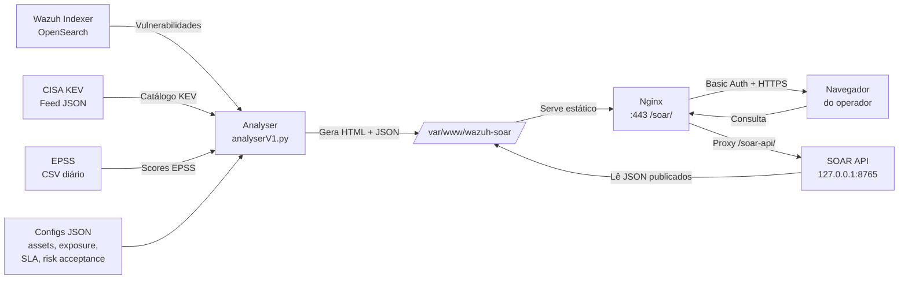
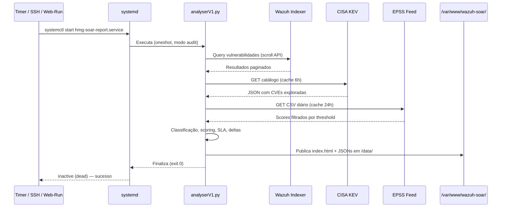
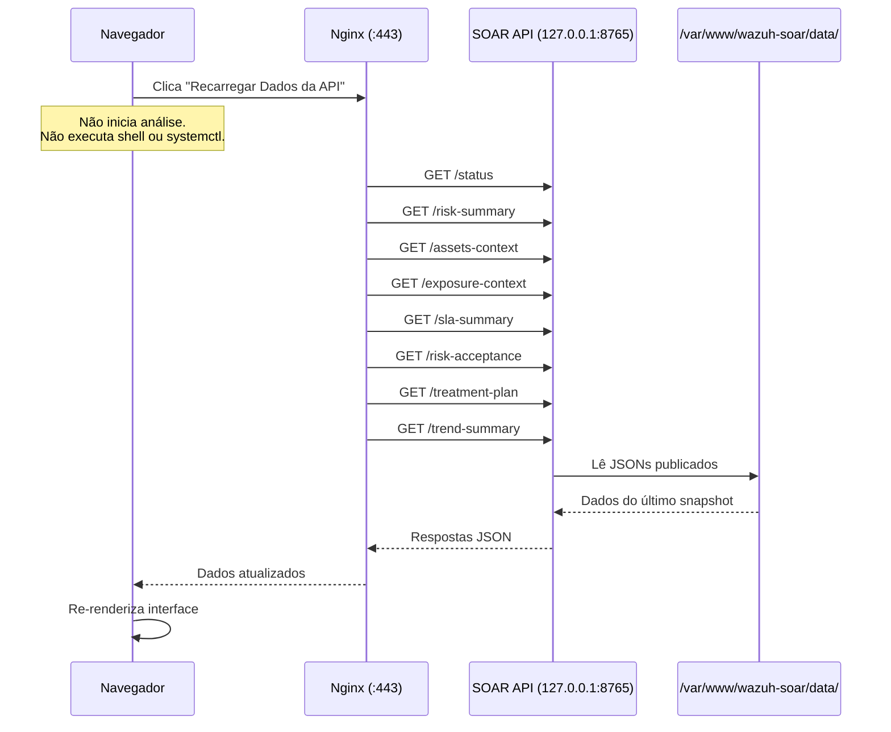
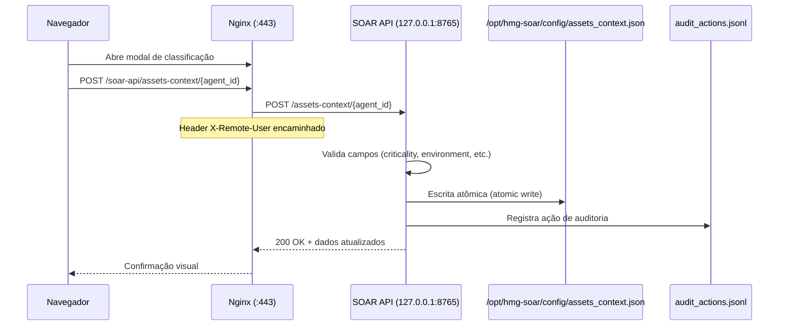
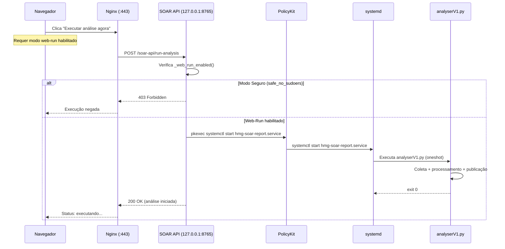

# Arquitetura do Sistema

Descrição arquitetural do EyeMole SOAR com diagramas, componentes, fontes de inteligência, modelo de segurança e fluxo de dados. Todas as informações foram confirmadas diretamente no código-fonte, systemd units, e configurações Nginx.

---

## Sumário

- [Visão Geral](#visão-geral)
- [Diagramas](#diagramas)
- [Componentes](#componentes)
- [Fontes de Inteligência](#fontes-de-inteligência)
- [Modelo de Segurança](#modelo-de-segurança)
- [Fluxo de Dados JSON Publicados](#fluxo-de-dados-json-publicados)
- [Diretórios e Arquivos Principais](#diretórios-e-arquivos-principais)

---

## Visão Geral

O EyeMole SOAR é composto por:

1. **Analyser** (`analyserV1.py`) — script principal que coleta vulnerabilidades do Wazuh/OpenSearch, cruza com CISA KEV e EPSS, calcula prioridades e scores, e publica relatórios estáticos.
2. **SOAR API** (`soar_api.py`) — serviço HTTP local que expõe dados processados para o Dashboard e permite classificação de ativos.
3. **Dashboard** — interface web HTML estática gerada pelo Analyser e servida via Nginx.
4. **Serviços systemd** — timer para agendamento e units para execução.
5. **Nginx** — proxy reverso com autenticação Basic Auth.

---

## Diagramas

### Diagrama 1 — Fluxo Geral de Dados

### Diagrama 2 — Geração de Nova Análise

### Diagrama 3 — Recarregamento dos Dados no Navegador

**Diferença fundamental:**
- **Recarregar Dados** = consulta API/JSON e atualiza a interface. Não inicia análise, não executa shell nem systemctl.
- **Executar nova análise** = inicia `hmg-soar-report.service`, gera novo snapshot. Ocorre via timer, SSH ou web-run habilitado.

### Diagrama 4 — Classificação de Ativo

### Diagrama 5 — Execução Manual no Modo Web-Run

---

## Componentes

### Analyser (`analyserV1.py`)

- **Descrição:** Script principal de coleta, análise e publicação.
- **Responsabilidades:** consulta vulnerabilidades no Wazuh Indexer (OpenSearch), cruza com KEV e EPSS, classifica prioridades, calcula Risk Score Contextual, aplica política de SLA, gera deltas comparativos, publica HTML e JSONs.
- **Dependências:** Wazuh Indexer (OpenSearch), feeds CISA KEV e EPSS, configs JSON locais.
- **Interfaces:** leitura via HTTPS do Indexer; escrita em `/var/www/wazuh-soar/` e `/opt/hmg-soar/output/`.
- **Execução:** via `hmg-soar-report.service` (oneshot).

### SOAR API (`soar_api.py`)

- **Descrição:** Serviço HTTP local que expõe dados processados.
- **Responsabilidades:** serve JSONs publicados pelo Analyser, aceita classificação de ativos, reporta status operacional, permite execução manual (quando modo web-run ativo).
- **Dependências:** JSONs em `/var/www/wazuh-soar/data/`, `assets_context.json`.
- **Interface:** `127.0.0.1:8765` (HTTP, loopback exclusivo).
- **Execução:** via `hmg-soar-api.service` (Type=simple, restart on-failure).

### Nginx (Proxy Reverso)

- **Descrição:** Serve o Dashboard e faz proxy para a API.
- **Responsabilidades:** autenticação Basic Auth, HTTPS/TLS, headers de segurança, proxy reverso para API local.
- **Rotas:**
  - `/soar/` → alias `/var/www/wazuh-soar/` (Dashboard estático)
  - `/soar/data/` → alias `/var/www/wazuh-soar/data/` (JSONs, no-cache)
  - `/soar-api/` → proxy para `http://127.0.0.1:8765/`
- **Autenticação:** Basic Auth via `/etc/nginx/.htpasswd-wazuh-soar`.
- **Header encaminhado:** `X-Remote-User` (identidade do operador autenticado).

### Timer Service (`hmg-soar-report.timer`)

- **Descrição:** Agendamento automático da geração de relatórios.
- **Ciclo:** a cada 6 horas (`OnCalendar=*-*-* 00/6:00:00`).
- **Persistent:** `true` — se o servidor estava desligado no horário, executa ao ligar.
- **RandomizedDelaySec:** 300 (até 5 min de atraso aleatório para evitar pico).

### Report Service (`hmg-soar-report.service`)

- **Descrição:** Unidade oneshot que executa o Analyser.
- **Tipo:** `oneshot` — executa e termina (`inactive (dead)` é o estado normal após conclusão).
- **Usuário/Grupo:** `hmg-soar` / `www-data`.
- **EnvironmentFile:** `/etc/hmg-soar/credentials.env` (credenciais de acesso ao Indexer e Wazuh API).
- **Modo fixo:** `--mode audit` (nunca executa correção automática).

### API Service (`hmg-soar-api.service`)

- **Descrição:** Mantém a SOAR API ativa continuamente.
- **Tipo:** `simple` — processo contínuo.
- **Restart:** `on-failure` com `RestartSec=5`.
- **Usuário/Grupo:** `hmg-soar` / `www-data`.
- **Bind:** somente `127.0.0.1:8765` (nunca em 0.0.0.0).

---

## Fontes de Inteligência

### CISA KEV (Known Exploited Vulnerabilities)

| Item | Valor |
|---|---|
| URL primária | `https://www.cisa.gov/sites/default/files/feeds/known_exploited_vulnerabilities.json` |
| URL fallback | `https://raw.githubusercontent.com/cisagov/kev-data/main/known_exploited_vulnerabilities.json` |
| Cache | TTL genérico de 6 horas (constante `CACHE_TTL_HOURS`) |
| Formato | JSON (`catalogVersion`, `dateReleased`, `count`, `vulnerabilities[]`) |

### EPSS (Exploit Prediction Scoring System)

| Item | Valor |
|---|---|
| URL primária | `https://epss.cyentia.com/epss_scores-current.csv.gz` (CSV diário comprimido) |
| URL fallback | `https://api.first.org/data/v1/epss` (API REST paginada) |
| Cache CSV em disco | TTL de 24 horas (`EPSS_CSV_CACHE_TTL_HOURS`) |
| Cache JSON filtrado | TTL genérico de 6 horas |
| Filtragem | Apenas CVEs com score ≥ `epss_threshold` são retidos |

**Estratégia de resiliência (6 níveis):**
1. Cache JSON filtrado válido
2. CSV diário em disco (arquivo .csv.gz local)
3. Download ao vivo do CSV streaming
4. FIRST API paginada (fallback REST)
5. Cache JSON expirado (stale)
6. Dict vazio com aviso crítico

---

## Modelo de Segurança

### Identidade e Permissões

| Aspecto | Configuração |
|---|---|
| Usuário de execução | `hmg-soar` |
| Grupo | `www-data` |
| UMask | `0027` |

### Sandbox systemd (ambos os serviços)

| Diretiva | Valor |
|---|---|
| `NoNewPrivileges` | true |
| `PrivateTmp` | true |
| `PrivateDevices` | true (apenas API service) |
| `ProtectSystem` | strict |
| `ProtectHome` | true |
| `ProtectKernelTunables` | true |
| `ProtectKernelModules` | true |
| `ProtectControlGroups` | true |
| `CapabilityBoundingSet` | vazio (sem capabilities) |
| `AmbientCapabilities` | vazio |
| `MemoryDenyWriteExecute` | true (apenas API service) |
| `RestrictNamespaces` | true (apenas API service) |
| `LockPersonality` | true |
| `SystemCallArchitectures` | native |
| `RestrictRealtime` | true |
| `RestrictSUIDSGID` | true |

### Filesystem (API Service)

| Tipo | Caminhos |
|---|---|
| `ReadOnlyPaths` | `/opt/hmg-soar` |
| `ReadWritePaths` | `/var/www/wazuh-soar/data`, `/opt/hmg-soar/audit`, `/opt/hmg-soar/config` |

### Filesystem (Report Service)

| Tipo | Caminhos |
|---|---|
| `ReadWritePaths` | `/opt/hmg-soar/output`, `/opt/hmg-soar/.hmg_cache`, `/opt/hmg-soar/config`, `/var/www/wazuh-soar`, `/var/www/wazuh-soar/data`, `/var/www/wazuh-soar/reports`, `/var/www/wazuh-soar/assets` |

### Rede

- API vinculada **somente** a loopback (`127.0.0.1:8765`) — não é acessível externamente.
- Nginx faz proxy reverso em `/soar-api/` — único ponto de acesso externo, protegido por Basic Auth + HTTPS.

### Autenticação

- **Basic Auth Nginx** via arquivo `/etc/nginx/.htpasswd-wazuh-soar`.
- Header `X-Remote-User` encaminhado à API para identificação do operador.
- Credenciais do Wazuh/Indexer em `/etc/hmg-soar/credentials.env` (lido apenas pelo Report Service via `EnvironmentFile`).

### Modos de Operação

| Modo | Comportamento |
|---|---|
| **Modo Seguro** (padrão) | Execução manual somente via SSH (`sudo systemctl start hmg-soar-report.service`). Botão web oculto. |
| **Web-Run** (opt-in) | Habilita execução via interface web usando PolicyKit restrito. Ativado com `install.sh --enable-web-run`. |

---

## Fluxo de Dados JSON Publicados

### Tabela de Endpoints da API

| Método | Rota interna (API) | Rota pública (Nginx) | Finalidade |
|---|---|---|---|
| GET | `/health` | `/soar-api/health` | Saúde da API |
| GET | `/status` | `/soar-api/status` | Estado operacional (modo, timer, última execução) |
| GET | `/audit-actions` | `/soar-api/audit-actions` | Log de ações de auditoria |
| GET | `/risk-summary` | `/soar-api/risk-summary` | Top prioridades, scores, alertas |
| GET | `/risk-delta` | `/soar-api/risk-delta` | Delta comparativo com snapshot anterior |
| GET | `/asset-context` | `/soar-api/asset-context` | Resumo de classificação de ativos (lê `asset_context_summary.json`) |
| GET | `/assets-context` | `/soar-api/assets-context` | Dados completos de classificação (lê `assets_context.json`) |
| GET | `/exposure-context` | `/soar-api/exposure-context` | Contexto de exposição dos ativos |
| GET | `/sla-summary` | `/soar-api/sla-summary` | Resumo de status de SLA |
| GET | `/risk-acceptance` | `/soar-api/risk-acceptance` | Regras de exceção de risco |
| GET | `/trend-summary` | `/soar-api/trend-summary` | Tendências e evolução do risco |
| GET | `/treatment-plan` | `/soar-api/treatment-plan` | Plano de tratativa |
| POST | `/run-analysis` | `/soar-api/run-analysis` | Dispara execução manual (requer web-run) |
| POST | `/assets-context/<agent_id>` | `/soar-api/assets-context/<agent_id>` | Atualiza classificação de um ativo |

**Rota alternativa:** `/context/assets` e `/context/assets/<agent_id>` são aliases para `/assets-context` e `/assets-context/<agent_id>` respectivamente.

### Diferença entre `/asset-context` e `/assets-context`

| Rota | Arquivo fonte | Conteúdo |
|---|---|---|
| `/asset-context` | `/var/www/wazuh-soar/data/asset_context_summary.json` | **Resumo** gerado pelo Analyser (total_seen, classified, unclassified, distribuição) |
| `/assets-context` | `/opt/hmg-soar/config/assets_context.json` | **Dados completos** de classificação de todos os ativos (editável via POST) |

### Arquivos JSON Publicados

### Arquivos JSON Publicados

Todos os arquivos JSON são publicados em `/var/www/wazuh-soar/data/` pelo Analyser e lidos pela SOAR API para servir ao Dashboard.

| Arquivo | Finalidade | Gerado por |
|---|---|---|
| `latest.json` | Snapshot completo de vulnerabilidades enriquecidas (dados atuais) | Analyser |
| `risk_summary.json` | Top prioridades, scores, alertas, contexto de ativos e exposição | Analyser |
| `risk_delta.json` | Comparação com snapshot anterior (novas, resolvidas, persistentes) | Analyser |
| `asset_context_summary.json` | Resumo do contexto de ativos (classificação, cobertura) | Analyser |
| `audit_actions.jsonl` | Log de auditoria em formato JSON Lines (append-only) | SOAR API |

Adicionalmente, a SOAR API escreve `audit_actions.jsonl` também em `/opt/hmg-soar/audit/`.

---

## Diretórios e Arquivos Principais

| Caminho | Tipo | Descrição |
|---|---|---|
| `/opt/hmg-soar/` | Diretório | Raiz da aplicação |
| `/opt/hmg-soar/analyserV1.py` | Script | Analyser principal |
| `/opt/hmg-soar/soar_api.py` | Script | SOAR API |
| `/opt/hmg-soar/config/` | Diretório | Configurações JSON |
| `/opt/hmg-soar/config/assets_context.json` | JSON | Classificação de ativos |
| `/opt/hmg-soar/config/exposure_context.json` | JSON | Contexto de exposição |
| `/opt/hmg-soar/config/sla_policy.json` | JSON | Política de SLA customizada |
| `/opt/hmg-soar/config/risk_acceptance.json` | JSON | Regras de exceção de risco |
| `/opt/hmg-soar/config/treatment_policy.json` | JSON | Política de tratamento |
| `/opt/hmg-soar/.hmg_cache/` | Diretório | Cache de KEV, EPSS e dados intermediários |
| `/opt/hmg-soar/output/` | Diretório | Relatórios gerados (CSV, PDF, HTML) |
| `/opt/hmg-soar/audit/` | Diretório | Log de auditoria local |
| `/var/www/wazuh-soar/` | Diretório | Web root servido pelo Nginx |
| `/var/www/wazuh-soar/index.html` | HTML | Dashboard (gerado pelo Analyser) |
| `/var/www/wazuh-soar/data/` | Diretório | JSONs publicados (snapshots, risk_summary, deltas) |
| `/var/www/wazuh-soar/data/snapshots/` | Diretório | Histórico de snapshots timestamped |
| `/var/www/wazuh-soar/reports/` | Diretório | Relatórios históricos (imutáveis, cache longo) |
| `/var/www/wazuh-soar/assets/` | Diretório | Assets estáticos (logo) |
| `/etc/hmg-soar/credentials.env` | Arquivo | Credenciais do Indexer e Wazuh API |
| `/etc/nginx/.htpasswd-wazuh-soar` | Arquivo | Credenciais Basic Auth |

---

*Documento gerado a partir do código-fonte atual (`analyserV1.py`, `soar_api.py`, `systemd/`, `nginx/`). Informações não confirmáveis estão marcadas com ⚠️.*
